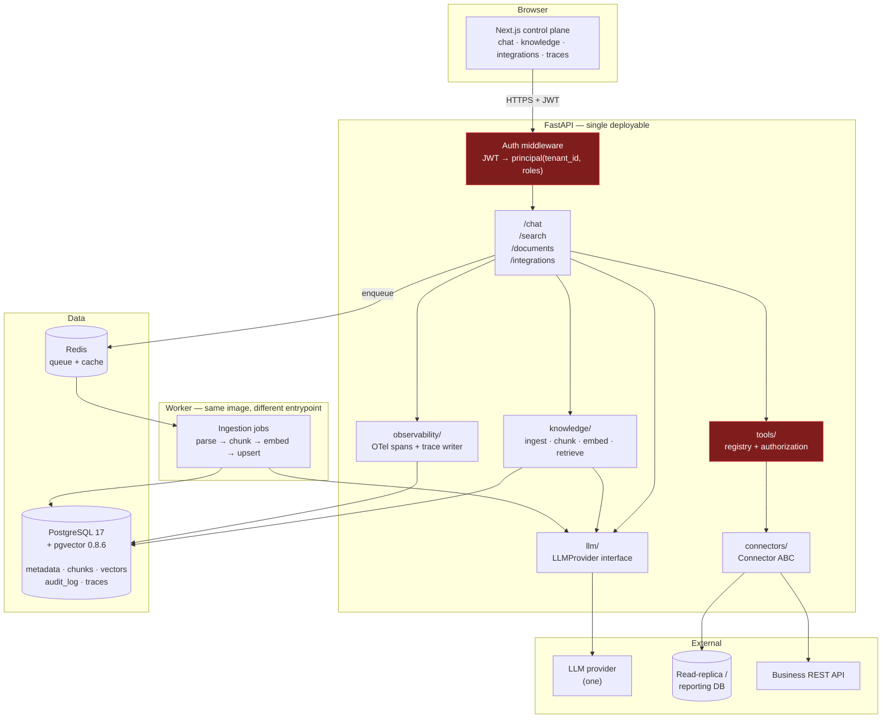
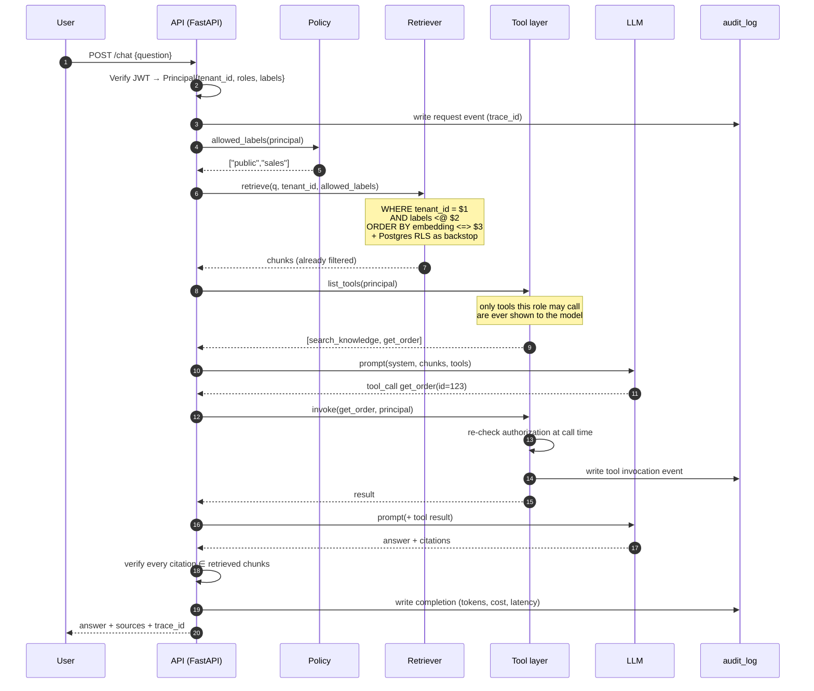
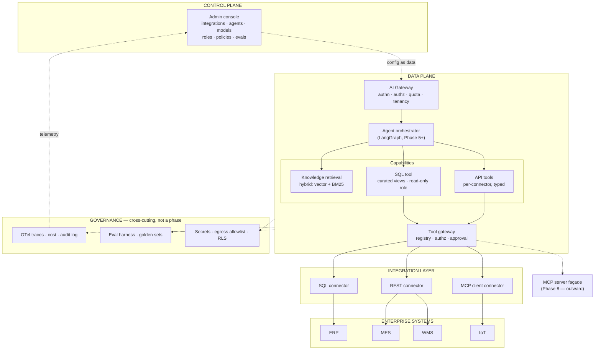
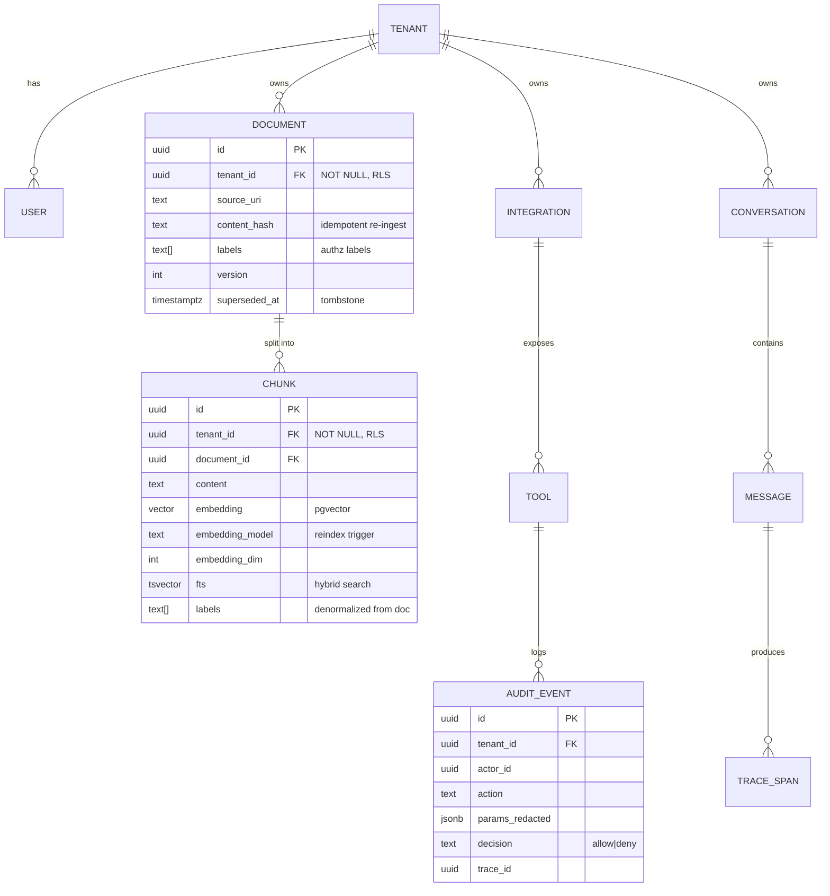
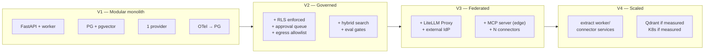

# Architecture Review — Enterprise AI Integration Platform

**Reviewer role:** senior AI architect / backend architect / security engineer / DevOps
**Date:** 2026-08-19
**Subject of review:** `claude.md` (33,633 bytes, 1,783 lines) — "Enterprise AI Integration Platform — Architecture & Learning Roadmap"
**Status:** Architecture discovery and feasibility analysis. **No implementation performed.**

---

## A. Executive Summary

### Verdict on the planning document

The document is **substantially correct at the conceptual level and substantially wrong at the sequencing level.**

The core insight — build one shared governed platform with pluggable connectors, not N isolated RAG systems — is right, and the three-way split of enterprise data into *unstructured knowledge (RAG)*, *structured data (SQL)*, and *live operational state (tools/APIs)* is the single most valuable idea in the document. Most people building "enterprise AI" get that split wrong and try to embed their ERP into a vector database. You already know not to.

The problem is the roadmap. The document argues forcefully in §17 that "security must be architectural, not a later feature," and then schedules RBAC, tenant isolation, audit logs, SQL validation and tool authorization into **Phase 8**, behind six phases of feature work. The same happens to observability and evaluation. This is the most consequential defect in the plan: those three concerns are *data-model* concerns, not features. Retrofitting `tenant_id`, permission labels, and trace IDs into a working RAG pipeline means rewriting the ingestion pipeline, re-embedding the entire corpus, and invalidating every stored trace. Retrofitting them is a rewrite; including them on day one costs roughly a day.

### What I recommend

**Build a boring modular monolith with an interesting data model.**

```
Next.js (control plane UI)
      │
FastAPI (single deployable, modular internally)
      │
      ├── knowledge/    hand-written ingest → chunk → embed → retrieve
      ├── connectors/   one ABC; SQL + REST implementations
      ├── tools/        registry + per-tool authorization
      ├── llm/          thin provider interface (one provider behind it)
      └── agent/        (empty until Phase 5)
      │
PostgreSQL 17 + pgvector 0.8.6   ← metadata AND vectors AND audit AND traces
Redis                            ← queue + cache
One background worker            ← ingestion
```

Three deviations from your document, each of which I defend in §E:

1. **No LlamaIndex in V1.** It is a 0.x package (currently 0.14.23) with a history of breaking reorganizations, and the part of it you need in Phase 1 — load, split, embed, store, cosine-search — is roughly 250 lines of code you should write by hand because writing it is the learning. Adopt LlamaIndex later for its document *readers* (PDF/DOCX/XLSX parsing is genuinely tedious) if and when you want them, behind your own interface.
2. **No LangGraph until Phase 5.** LangGraph 1.2.11 is now a stable 1.x and it is the right choice *when you have a real loop with durability, interrupts and checkpointing*. In Phase 1 you have a single function call. Adding a graph framework to a straight line is pure cost.
3. **No Langfuse self-hosted in V1.** Self-hosted Langfuse requires Postgres **plus ClickHouse plus Redis plus S3-compatible blob storage plus two application containers**. That is four new infrastructure dependencies to see your own traces. Emit OpenTelemetry spans from day one — that is the durable, non-lock-in decision — and write traces to a Postgres table you own. Point the OTLP exporter at Langfuse Cloud (or a self-hosted instance) later; the application code does not change.

The through-line: **own your contracts, rent your implementations.** Every external framework sits behind an interface you wrote, so that replacing it is a file, not a project.

### The one-sentence version

Build the smallest thing that has a `tenant_id`, an authorization filter, a trace, and a citation — then grow it; do not build a working chatbot and try to add those four things afterwards.

---

## B. Current State of the Repository

### What exists

I inspected `C:\Users\user\Desktop\Ai\Source Code` and its parent.

| Path | Size | Notes |
|---|---|---|
| `Source Code/claude.md` | 33,633 bytes | The architecture document |
| `Source Code 2/enterprise_ai_integration_platform_architecture.md` | 33,633 bytes | **Byte-identical duplicate** (verified with `diff` — no differences) |
| `Ai/File Naming and documentation.docx` | 20,286 bytes | Not inspected; appears unrelated to the platform |

**That is the entire repository.** There is no source code, no `package.json`, no `pyproject.toml`, no `requirements.txt`, no Dockerfile, no `docker-compose.yml`, no `.env`, no SQL, no CI configuration, no tests, and no hidden config directories. I searched for all of these explicitly.

### Findings

**B1. This is not a git repository.** `git rev-parse` fails. Nothing is under version control. For a project whose stated purpose is learning production engineering, this is the first thing to fix — before any code exists, so that the architecture documents themselves have history.

**B2. `claude.md` is being loaded as `CLAUDE.md`.** Windows filesystems are case-insensitive. Your architecture document *is* the agent instruction file — 33KB of architectural prose, written in the imperative mood ("Do not...", "Use...", "Prefer..."), injected into every AI coding session as standing instructions. This is an architectural conflict in the literal sense: a design artifact is masquerading as a configuration artifact. Two problems follow: the vision document will drift as it gets edited for agent-behavior reasons, and a large block of aspirational future-state text will be treated as current-state instruction.

> **Recommendation:** rename to `docs/ARCHITECTURE_VISION.md`. Write a genuinely new, short `CLAUDE.md` (40–80 lines) containing only: how to run the app, how to run tests, the layering rules that must not be violated, and the security invariants. Link out to the vision doc.

**B3. `Source Code` and `Source Code 2` are a fork waiting to happen.** Two byte-identical copies of the same document in two sibling directories, with no version control to reconcile them. Pick one directory as the repository root, `git init` it, and delete the other copy.

**B4. Toolchain gaps.**

| Tool | Installed | Assessment |
|---|---|---|
| Python | **3.14.4** | ⚠️ Too new — see B5 |
| Node.js | 24.14.0 | Fine |
| npm | 11.9.0 | Fine |
| git | 2.53.0 | Fine, but unused |
| uv | 0.11.7 | Good — use it as the Python package manager |
| **Docker** | **Not installed** | ❌ Blocks the entire Phase 0 infrastructure plan |
| Poetry | Not installed | Not needed; `uv` is present and better |

**B5. Python 3.14 will cause pain.** LangGraph 1.2.11 declares `requires-python >=3.10` but its trove classifiers stop at **3.13** — it does not yet claim 3.14 support. LiteLLM 1.97.0 declares `<3.15`, so it permits 3.14. LlamaIndex-core 0.14.23 and Langfuse 4.14.4 both declare `>=3.10,<4.0`. The binary dependencies underneath (tokenizers, pydantic-core, psycopg, numpy, lxml) are where 3.14 actually bites — you get source builds or no wheels.

> **Recommendation:** pin **Python 3.12** for this project via `uv python pin 3.12`. It has the broadest wheel coverage in the AI ecosystem and a long support horizon. Do not fight your toolchain while also learning the architecture — that is the same mistake as learning Kubernetes and AI simultaneously, which your own §18 correctly warns against.

**B6. Docker Desktop is a prerequisite, not an assumption.** Your document's §18 and §25 both assume Docker Compose is available. It is not installed. Installing Docker Desktop on Windows 11 Pro also means enabling WSL2. Budget real time for this; it is Phase 0 work, not a footnote.

### What can be reused

The document's **conceptual content** — the three data categories, the connector interface sketch in §14, the metadata-driven configuration model in §15, the two-plane split in §16, and the "hard parts" list in §24 — is genuinely good and should be carried forward into the design docs. §24 in particular is an accurate list of what will actually be difficult.

### What should NOT be reused

- **The Phase 1–8 sequencing** (see §H and the roadmap document).
- **The §9 technology table as an installation list.** It names 20 technologies. Treat it as a *destination map*, not a shopping list; roughly 6 of the 20 belong in V1.
- **The TypeScript `AIConnector` interface in §14.** Not because the shape is wrong — the shape is broadly right — but because the backend is Python, so this needs to be a Python ABC. Also `connect()` returning `Promise<void>` as a separate lifecycle method from `testConnection()` invites stateful connector objects holding live connections, which fights with worker processes and connection pooling. See §G-16.

---

## C. Target Architecture

### C.1 V1 — what to actually build



The two red boxes are the chokepoints. **Every** request passes through `AUTH` and acquires a `Principal`. **Every** tool invocation and **every** retrieval passes a filter derived from that principal. There is no second path.

### C.2 Request lifecycle — where authorization actually happens

This is the diagram that matters most, because it is the one your document's §17 describes correctly in prose but never pins to a component.



Three non-obvious points encoded here:

- **Filtering happens in the SQL `WHERE` clause, not after retrieval.** Retrieving 20 chunks and then dropping the ones the user may not see is a correctness bug *and* an information leak (top-k becomes top-3, silently degrading answers) *and* a timing side channel.
- **Tool authorization is checked twice** — once when building the tool list shown to the model, and again at invocation. The first check is UX and prompt-economy; the second is the actual security boundary. Never rely on "the model wasn't told about that tool."
- **Citations are verified against retrieved chunk IDs before the response leaves the server.** Models fabricate citation identifiers. If you display an unverified citation, you have built a machine that manufactures false authority.

### C.3 Target enterprise architecture (where V1 grows to)



Note the placement of `MCP server façade`: **outward-facing, at the edge**. See §E and §G-14 for why the document's Phase 7 framing of MCP is backwards.

### C.4 The data model that makes the rest possible



Four columns in there are the whole argument of this review: `tenant_id` (isolation), `labels` (data-level authorization), `embedding_model` (survives a model change without a mystery), and `content_hash` (survives a re-ingest without duplicates). Each costs one line in a migration on day one and a weekend to retrofit in Phase 8.

---

## D. Component Responsibilities

| Component | Owns | Explicitly does NOT own | Why it is a separate module |
|---|---|---|---|
| **`api/`** | HTTP surface, request validation, response shaping, streaming | Business logic, SQL, prompts | Keeps transport swappable; lets you add an MCP or gRPC surface later without touching logic |
| **`core/security`** | JWT verification, `Principal` construction, policy evaluation (`allowed_labels`, `can_call_tool`) | Deciding *what* to retrieve | One place to audit. If authorization logic is scattered you cannot prove it is correct |
| **`knowledge/`** | Parse → clean → chunk → embed → upsert; retrieval with mandatory tenant+label filter | Answer generation | Retrieval quality is independently testable and independently the biggest lever on output quality |
| **`connectors/`** | The `Connector` ABC and its implementations; credential resolution; connection health; egress enforcement | Deciding when to call anything | This is the extension point of the whole platform. It must be the most stable interface in the codebase |
| **`tools/`** | Tool registry, JSON schemas, per-tool authorization, argument validation, result truncation, audit emission | Tool *implementations* (those live with connectors) | The security chokepoint for anything the model can *do*, as opposed to *read* |
| **`llm/`** | `LLMProvider` interface: `complete()`, `embed()`, token counting, cost attribution, retry/timeout | Prompt content | Makes the provider a config value. Also the only place cost is measurable |
| **`agent/`** | Orchestration graph, state, checkpointing, loop limits *(empty until Phase 5)* | Tool authorization, retrieval filtering | Deliberately powerless: the agent decides *what to try*, the tool layer decides *what is allowed* |
| **`observability/`** | OTel span creation, trace persistence, cost/token accounting | Business decisions | Must be usable from every layer without circular imports |
| **`worker/`** | Long-running ingestion and sync jobs | Serving requests | Ingestion is minutes-scale and bursty; it must not share a request thread pool |
| **`evals/`** | Golden question sets, retrieval and answer scoring, regression gates | Production code paths | Lives outside `app/` so it can never be imported by production code |

**The layering rule** (this belongs in the new `CLAUDE.md`): dependencies point downward only.

```
api → agent → tools → connectors → external
api → knowledge → llm
everything → core, observability
nothing → api
```

If `connectors/` ever imports from `agent/`, the connector abstraction has failed.

---

## E. Technology Decisions

Each row states the V1 call. "Complexity" is operational burden 1–5. "Lock-in" is how painful replacement is.

| Component | Recommendation (V1) | Alternatives considered | Complexity | Lock-in | Reason / when it fails |
|---|---|---|---|---|---|
| **Language / runtime** | **Python 3.12** | 3.13, 3.14 (installed), Node/TS backend | 1 | — | 3.14 is installed but LangGraph's classifiers stop at 3.13 and binary wheels lag. Python wins over TS because the retrieval/eval/data ecosystem is there. Pin with `uv python pin 3.12` |
| **Package manager** | **uv** (already installed) | pip+venv, Poetry, PDM | 1 | Low | Fast, lockfile-based, manages the interpreter itself. Poetry is not installed and offers nothing extra here |
| **Web framework** | **FastAPI** | Litestar, Django+DRF, Flask | 1 | Low | Pydantic-native (you need typed tool schemas anyway — same objects serve as JSON Schema for tool calling), async, first-class OpenAPI. Litestar is arguably cleaner but has a smaller hiring/answer pool |
| **Deployment shape** | **Modular monolith**, 2 processes (api, worker) | Microservices, serverless | 1 | Low | You have one developer. Service boundaries you cannot yet validate become distributed bugs. The module layout in §D *is* the future service boundary — extract when a module needs independent scaling, not before |
| **Primary DB** | **PostgreSQL 17** | MySQL, SQL Server | 2 | Medium | Non-negotiable: you need `pgvector`, `tsvector` full-text, `JSONB`, RLS, and `LISTEN/NOTIFY` in one engine |
| **Vector store** | **pgvector 0.8.6** in the same Postgres | Qdrant, Milvus, Weaviate, Pinecone | 1 | **Low** | Current guidance is consistent: pgvector is sufficient below roughly 5M vectors, and the decisive advantage is that a vector query can `JOIN` your permission tables and be covered by the same RLS policy in the same transaction. 0.8.0+ added **iterative index scans**, which is precisely what makes filtered (multi-tenant) vector search work well. Migrate to Qdrant when p95 retrieval exceeds budget at your real corpus size — not before |
| **Vector store (later)** | Qdrant | Milvus (heavier), managed Pinecone (lock-in + data residency) | 3 | Medium | Rust engine, better at tens of millions of vectors, quantization, distributed sharding. The cost is a second datastore and losing the transactional `JOIN`. Defer the decision behind a `VectorStore` interface |
| **Embeddings** | **One hosted model**, dimension recorded per row | Self-hosted BGE/E5, Voyage, Cohere | 1 | **Medium — underestimated** | The real lock-in is not the API, it is the **corpus**: changing embedding model means re-embedding everything. Store `embedding_model` and `embedding_dim` on every chunk from day one so a migration is a background job, not an archaeology project. Note pgvector's index limits: 2,000 dims for `vector`, 4,000 for `halfvec` |
| **Hybrid search** | **Postgres `tsvector` + vector, fused with RRF** | Vector-only, Elasticsearch, dedicated BM25 | 1 | Low | **Missing from your document entirely.** Enterprise corpora are full of part numbers, error codes and SKUs — exactly the tokens embeddings handle worst. Postgres gives you lexical search for free. This is the highest-value, lowest-cost retrieval improvement available to you |
| **Reranker** | **None in V1** | Cohere Rerank, BGE-reranker | 2 | Low | Adds a network hop and cost per query. Only justified once evals show retrieval recall is good but precision is poor. Measure before buying |
| **RAG framework** | **None — hand-written** | LlamaIndex, LangChain, Haystack | 1 | **None** | LlamaIndex-core is **0.14.23** — still 0.x, with a history of breaking package reorganizations. In Phase 1 it would abstract ~250 lines you should write yourself, because those 250 lines *are* the curriculum: chunk boundaries, overlap, metadata propagation, distance operators, index tuning. Adopt it later, behind your own interface, for its document **readers** — PDF/DOCX/XLSX parsing is genuinely tedious and not educational |
| **Agent orchestration** | **None in V1; LangGraph 1.2.11 from Phase 5** | Hand-rolled loop, LlamaIndex Workflows, CrewAI, AutoGen | 3 | Medium | LangGraph reaching stable 1.x removes the main objection. It earns its place when you need durable checkpointing, human-in-the-loop interrupts and resumable runs — all of which are miserable to hand-roll. It earns nothing when the flow is `retrieve → generate`. **Add a hard loop/step limit and a cost ceiling from the first graph you write** — an orchestrator that never emits "finish" is the classic way to discover your API budget is gone |
| **LLM abstraction** | **Your own 40-line `LLMProvider` ABC**, one provider behind it | LiteLLM SDK, LiteLLM Proxy, LangChain chat models | 1 | **None** | Your §11 is right that provider calls must not be scattered — but the fix is *your* interface, not someone else's. LiteLLM 1.97.0 is a large, fast-moving surface. Adopt **LiteLLM Proxy** (the standalone gateway, not the SDK) when you genuinely need multi-provider routing, per-tenant budgets and key management; at that point it slots in behind your ABC as a base URL change |
| **Auth (V1)** | **OIDC-shaped JWT verification in FastAPI**, local user table | Keycloak, Auth0/Clerk, session cookies | 1 | Low | Keycloak is a JVM service with its own database and operational learning curve — a large tax to pay for logging one developer in. Build the `Principal` abstraction correctly and Keycloak becomes a swap of the token-verification function. **Design for it now; run it later** |
| **Auth (later)** | Keycloak (self-host) or the customer's IdP | Auth0, Entra ID | 4 | Medium | Real enterprise deployments will demand SAML/OIDC federation against *their* IdP. Because you own `Principal`, this is an adapter |
| **Tenant isolation** | **`tenant_id` NOT NULL on every row + Postgres RLS as backstop + transaction-scoped `SET LOCAL`** | App-layer filtering only, schema-per-tenant, DB-per-tenant | 2 | Low | Application filters are one forgotten `WHERE` away from a cross-tenant leak. RLS makes the leak *impossible at the engine*. **Critical operational detail: use transaction-level pooling, never statement-level**, or session context leaks between tenants. Schema-per-tenant breaks the shared HNSW index and does not scale past a few dozen tenants |
| **Secrets** | **Env vars + Postgres column encrypted with a KMS/app key**, never plaintext | HashiCorp Vault, cloud secret manager | 1 | Low | Connector credentials must live in the DB (the console creates them) — so encrypt at the application layer and keep the key out of the DB. Vault is Phase 10+. **Redact by type, not by regex**: wrap secrets in a `SecretStr`-style type whose `__repr__` is `***` |
| **Cache / queue** | **Redis** | RabbitMQ, Postgres-as-queue (SKIP LOCKED) | 1 | Low | You need it for both. Postgres-as-queue is genuinely viable at your scale and would remove a service — a legitimate simplification if you want one fewer moving part |
| **Background jobs** | **ARQ** or **Dramatiq** | Celery, Temporal, RQ | 1 | Low | Your doc says Celery. Celery is heavyweight, its config surface is enormous, and **it is poorly behaved on Windows** — relevant given your dev machine. ARQ is asyncio-native and matches FastAPI. Temporal is Phase 11+, if ever |
| **Observability** | **OpenTelemetry SDK → Postgres `trace_span` table** | Langfuse self-hosted, LangSmith, Phoenix | 1 | **None** | OTel is the vendor-neutral wire format; emitting it costs nothing extra and makes every backend an export target |
| **LLM observability UI** | **Langfuse Cloud** (or self-host at Phase 10) | LangSmith (couples you to LangChain), Arize Phoenix | 4 self-hosted | Low via OTel | Self-hosted Langfuse needs **Postgres + ClickHouse + Redis + S3/MinIO + web + worker containers**. That is a serious infrastructure commitment to look at traces. Because you emit OTel, this is a configuration decision you can defer indefinitely |
| **Metrics** | **`/metrics` Prometheus endpoint from day one; no Prometheus server yet** | Full Prometheus+Grafana | 1 → 3 | None | Instrumenting is cheap; running the stack is not. Add the server when you have an uptime question you cannot answer |
| **Evaluation** | **pytest + a golden-question YAML set + Recall@k / MRR** | Ragas, DeepEval, promptfoo, Langfuse datasets | 1 | None | Start with 20 questions and two metrics you understand. Metrics you cannot explain will not change your behavior. Adopt Ragas when you want faithfulness/groundedness scoring |
| **Frontend** | **Next.js (App Router) + TypeScript + Tailwind + shadcn/ui** | Vite+React SPA, SvelteKit, server-rendered Jinja | 2 | Low | Your doc says React/Next. Fine. Use it as a **pure client of the FastAPI API** — do not put business logic in route handlers, or you will have two backends |
| **MCP** | **Not in V1.** Later: an MCP *server* at the edge (outward) and an MCP *client* connector (inward) | Internal MCP between your own modules | 3 | Low | Spec is at **2026-07-28**. It is a genuinely good standard, and its authorization model (OAuth 2.1 resource server, RFC 8707 resource indicators, mandatory audience validation, explicit prohibition on token passthrough) is worth reading now as a design reference. But using MCP *inside one process* means JSON-RPC-serializing a Python function call to yourself. See §G-14 |
| **Reverse proxy** | **Caddy** | Nginx, Traefik | 1 | Low | Automatic HTTPS with a 5-line config. Nginx is more standard, more verbose, and needs a separate certbot dance. Traefik shines with dynamic orchestration you do not have |
| **Containers** | **Docker Compose** | Kubernetes, Podman, bare processes | 2 | Low | Your §18 is correct and I fully endorse it. **You must install Docker Desktop + WSL2 first** |
| **CI** | **GitHub Actions**: lint, type-check, unit, integration-on-ephemeral-Postgres | GitLab CI, none | 2 | Low | Add the retrieval eval as a scheduled job, not a PR gate — it costs money and is nondeterministic |
| **Migrations** | **Alembic** | Raw SQL files, no migrations | 1 | Low | **Missing from your document.** You will change the chunk schema repeatedly. Not having migrations turns each change into a manual production ritual |

### The three decisions I would defend hardest

1. **pgvector, not Qdrant.** Not because Qdrant is worse — it is faster at scale — but because being able to write `WHERE tenant_id = $1 AND labels && $2 ORDER BY embedding <=> $3` in a single transaction against a single engine, with RLS underneath, is a *security* property, not a performance one. You give that up the moment vectors live elsewhere and you have to synchronize permissions across two systems.

2. **No framework for RAG in V1.** Every framework you adopt before you understand the problem it solves teaches you the framework instead of the problem. You have explicitly said you want to understand the engineering decisions. Write the 250 lines.

3. **OTel now, Langfuse later.** The expensive, irreversible decision is *whether your code emits structured traces at all*. The cheap, reversible decision is *which UI renders them*. Get the ordering right.

---

## F. Risks

Scored **Likelihood × Impact**, highest first within each category.

### F.1 Technical risks

| # | Risk | L | I | Mitigation |
|---|---|---|---|---|
| T1 | **Retrieval quality is poor and you cannot tell** — answers sound fluent, sources are subtly wrong, no metric exists | High | High | Build `/search` (no LLM) before `/chat`. Golden set of 20 Q→expected-chunk pairs from week 1. Track Recall@5 |
| T2 | **Embedding model change forces full re-index** with no record of what was embedded with what | Medium | High | `embedding_model` + `embedding_dim` columns on `chunk`; migration = background re-embed job with dual-read |
| T3 | **Chunking strategy is wrong for your documents** (tables in PDFs, SOPs with numbered steps split mid-procedure) | High | Medium | Chunk on structure, not character count. Keep tables intact. Measure with the golden set, not by eye |
| T4 | **Framework churn** — LlamaIndex 0.x reorganizes, LangGraph 1.x → 2.x | Medium | Medium | Own interfaces; pin exact versions in the lockfile; upgrade deliberately |
| T5 | **Python 3.14 wheel gaps** stall the project on day one | High | Low | Pin 3.12 now |
| T6 | **pgvector recall degrades under heavy filtering** (HNSW returns k candidates, filters remove most) | Medium | Medium | pgvector 0.8.0+ iterative index scans; tune `hnsw.ef_search`; monitor "returned fewer than k" |
| T7 | Connector failure mid-agent-run leaves partial state | Medium | Medium | Per-tool timeouts, circuit breaker, explicit partial-result reporting to the model |

### F.2 Security risks

| # | Risk | L | I | Mitigation |
|---|---|---|---|---|
| **S1** | **Cross-tenant / cross-permission data leak via retrieval** — the single worst outcome for this system | Medium | **Critical** | `tenant_id` NOT NULL + RLS + filter in `WHERE` + an automated test that asserts tenant A's query never returns tenant B's chunk. Write that test in week 1 |
| **S2** | **Indirect prompt injection** (OWASP **LLM01**) — a malicious instruction inside an ingested PDF or an API response redirects the agent | **High** | **High** | Treat *all* retrieved content and *all* tool output as untrusted data, never instruction. Structural separation in the prompt. **The real control is not prompt engineering — it is that the tool layer authorizes independently of what the model was persuaded to ask for.** Assume injection succeeds; ensure it cannot reach anything |
| **S3** | **Connector config as SSRF/port-scan primitive** — the "Add Integration" form in your §3 accepts arbitrary host+port and has a "Test Connection" button | **High** | **High** | **Egress allowlist enforced server-side.** Block link-local (169.254.169.254 — cloud metadata), RFC1918 unless explicitly permitted, and re-resolve DNS at connect time to defeat rebinding. Admin-only, rate-limited, audited |
| S4 | **Excessive agency** (OWASP **LLM06**) — a tool does more than its name implies | Medium | High | Tools are narrow and typed. No generic `execute_sql` exposed to the model in V1. Write tools require human approval |
| S5 | **Text-to-SQL escapes read-only intent** via CTEs, `pg_read_file`, functions, or `;` stacking | Medium | High | Defense in depth: (a) a Postgres role with only `SELECT` on curated views, (b) `default_transaction_read_only`, (c) `statement_timeout`, (d) AST-level parse-and-validate (allowlist, not regex blocklist), (e) `LIMIT` injection. **(a) is the one that actually saves you** |
| S6 | **Sensitive information disclosure** (OWASP **LLM02**) — an HR PDF ingested with no label becomes world-readable inside the tenant | High | High | **Default-deny labeling**: a document with no explicit label is visible to nobody until classified. See §G-1 |
| S7 | **Secrets in logs/traces** — connector passwords in an exception, API keys in a span attribute | High | High | `SecretStr` types, a redaction filter on the logging handler, and a CI grep. Never log request bodies of `/integrations` |
| S8 | **Enterprise data leaves the network** to a third-party model provider — a legal/compliance question, not a technical one | High | High | **Unaddressed in your document.** Decide explicitly and write it down. Zero-retention agreements, or a self-hosted model for regulated data classes |
| S9 | **Unbounded consumption** (OWASP **LLM10**) — a runaway agent loop or an adversarial user burns the budget | Medium | Medium | Per-tenant token quotas, per-request cost ceiling, hard loop limits, rate limiting |

### F.3 Scalability risks

| # | Risk | L | I | Mitigation |
|---|---|---|---|---|
| Sc1 | HNSW index no longer fits in RAM (the cliff for pgvector performance) | Low (V1) | High | Monitor index size vs `shared_buffers`. `halfvec` halves storage. Qdrant is the escape hatch |
| Sc2 | Ingestion of a large corpus blocks the queue for hours | Medium | Low | Separate queues by priority; chunk-level batching; resumable jobs keyed by `content_hash` |
| Sc3 | Embedding API rate limits during bulk ingest | High | Low | Batch, backoff, concurrency cap |
| Sc4 | Long agent runs hold HTTP connections open | Medium | Medium | Stream (SSE) from the start; move to job+poll for multi-minute runs |

### F.4 Data risks

| # | Risk | L | I | Mitigation |
|---|---|---|---|---|
| D1 | **Stale knowledge** — a superseded SOP still answers questions confidently | **High** | **High** | Document versioning + `superseded_at` tombstones + hard-delete of chunks on document delete. Surface document date in every citation |
| D2 | Duplicate chunks from re-ingesting the same file | High | Medium | `content_hash` uniqueness per tenant; upsert semantics |
| D3 | Deleted source document remains retrievable | Medium | High | Deletion must cascade to chunks **and** any cache. Test it |
| D4 | No backup of derived data — but embeddings cost real money to regenerate | Medium | Medium | Back up Postgres including vectors; treat re-embedding cost as a recovery-time factor |
| D5 | PII in chunks, traces and eval fixtures spreads to places with weaker controls | Medium | High | PII scan at ingest; redact trace payloads; **never** copy production data into `evals/` |

### F.5 AI reliability risks

| # | Risk | L | I | Mitigation |
|---|---|---|---|---|
| **A1** | **Text-to-SQL is wrong and looks right.** Best published systems reach roughly **82% execution accuracy on BIRD** against **~93% for human experts** — and that benchmark's own metric has been shown to disagree with expert judgment a meaningful fraction of the time | **High** | **High** | **Do not present NL→SQL results as facts.** Always show the generated SQL and the row count. Restrict to curated, documented views with a semantic layer (column descriptions, few-shot examples). Treat it as a drafting aid for analysts before you treat it as an answer engine for executives |
| A2 | Hallucinated citations | High | High | Verify every citation ID against retrieved chunks server-side; drop unverifiable ones |
| A3 | Model does not refuse when context is insufficient | High | Medium | Explicit "answer only from context; otherwise say you don't know" + an eval set of *unanswerable* questions. Track the refusal rate as a first-class metric |
| A4 | Wrong tool selected | Medium | Medium | Few, well-named, namespaced tools with high-signal descriptions. Consolidate workflows rather than exposing every endpoint. Eval on tool-selection accuracy |
| A5 | Silent regression when a prompt or model changes | High | High | Eval suite run before any prompt/model change. Version prompts in git |
| A6 | Model deprecation by the provider | High | Medium | `LLMProvider` interface + model name in config; eval suite is the acceptance test for a swap |

### F.6 Operational risks

| # | Risk | L | I | Mitigation |
|---|---|---|---|---|
| **O1** | **Solo-developer scope collapse** — 20 technologies, one person, no shipped increment | **High** | **High** | This is the most likely failure mode of the whole project. Ruthless phase gating. Ship Phase 1 to a real user before starting Phase 2 |
| O2 | Docker/WSL2 not installed; environment setup consumes the first week | High | Medium | Do it in Phase 0, timeboxed, before any application code |
| O3 | Cost surprise from bulk embedding or a loop | Medium | Medium | Cost per request recorded from day one; a daily budget alarm |
| O4 | No rollback path for a bad deploy | Medium | Medium | Tagged images, `docker compose` pinned by digest, reversible Alembic migrations |
| O5 | The `claude.md`/`CLAUDE.md` collision quietly steers AI-assisted development | High | Low | Rename (§B2) |

---

## G. Missing Components

Ordered by how expensive they are to add late.

**G1. The document permission model — where do `labels` come from?**
§13 shows `"permissions": ["sales"]` in a metadata blob and never says who assigns it. This is the hardest unsolved problem in enterprise RAG and your plan does not acknowledge it exists. Options: inherit from the source system's ACL (best, hard), inherit from the ingestion folder/collection (pragmatic, good enough for V1), manual classification in the console (fine at low volume), or LLM-assisted classification (a suggestion, never an authority). **Decide in Phase 1. Default must be deny.**

**G2. Document lifecycle — versioning, supersession, deletion, re-index.**
Enterprise documents change constantly. Your pipeline is one-directional: documents in, chunks forever. You need: content hashing for idempotent re-ingest, version numbers, `superseded_at` tombstones, cascading hard-delete, and a "reindex this collection" operation. Retrofitting this means auditing every chunk you ever created.

**G3. Hybrid retrieval (lexical + vector).**
Your document only ever mentions embeddings. Enterprise queries contain part numbers, error codes, SKUs and internal acronyms — exactly what dense embeddings handle worst. Postgres `tsvector` + Reciprocal Rank Fusion is a small amount of code and typically the largest single retrieval improvement available. Its absence is the biggest technical omission in the plan.

**G4. A semantic layer for text-to-SQL.**
§3's "Discover Schema" implies dumping raw table structure into a prompt. That performs badly on real schemas — cryptic column names, no documented join paths, no business definitions. You need curated views with descriptions, documented joins, canonical metric definitions, and few-shot example queries. **The semantic layer, not the model, is what makes NL→SQL work.**

**G5. Explicit data-egress and residency policy.**
Which data classes may be sent to a third-party model provider? Not mentioned anywhere. For an ERP/MES/WMS platform this is a blocking legal question, and it constrains architecture (it may force a self-hosted model for some tenants). Write it down before you ingest anything real.

**G6. Cost accounting and budget enforcement.**
§19 lists cost in the trace, but there is no design for per-tenant budgets, quotas, or what happens at the limit. Token cost must be attributed to `tenant_id` and `user_id` from the first LLM call — it is nearly impossible to backfill.

**G7. Human-in-the-loop approval for write operations.**
§4 says "AI → Approved Tool → Business API." *Approved by whom, when, recorded where?* You need an approval queue: the agent proposes an action, a human sees the exact payload, approves or rejects, and the decision is audited. This is the mechanism that makes write access safe.

**G8. Refusal and grounding policy.**
"Show sources" is not the same as "refuse when unsourced." Define the behavior when retrieval returns nothing relevant, and put unanswerable questions in the eval set.

**G9. Testing strategy for a nondeterministic system.**
No mention of how you test LLM-dependent code. You need: deterministic unit tests with a fake `LLMProvider`, recorded-fixture integration tests, and a separately-run nondeterministic eval suite. Conflating these makes CI flaky and useless.

**G10. Database migrations (Alembic).** Absent entirely.

**G11. Streaming, timeouts and cancellation.** A 5-second agent response needs SSE; a runaway one needs a kill switch. Retrofitting streaming through a synchronous stack is a rewrite of the API layer.

**G12. Connector egress control.** See S3. The connector subsystem is a server-side request generator driven by user-supplied addresses. It needs an allowlist as a first-class component, not a validation afterthought.

**G13. Rate limiting.** Listed in the §8 gateway box, never designed. Needed per-tenant, per-user, and per-tool.

**G14. MCP framed correctly — and it is currently backwards.**
Your §7 and Phase 7 propose MCP as the way your agent reaches your own connectors. Inside a single Python process that means JSON-RPC-serializing a function call to yourself for no benefit. MCP is valuable in exactly two places, both at the *edge*:
- **Outward (server):** expose your platform's governed tools so Claude Desktop, IDEs and other agents can use them. This is a genuine product feature.
- **Inward (client):** consume third-party MCP servers as one more connector type behind your `Connector` ABC.

Also worth reading now even though you will not implement it for a year: the current spec (**2026-07-28**) requires MCP servers acting as OAuth 2.1 resource servers to **validate that tokens were issued specifically for them** (RFC 8707 resource indicators) and **MUST NOT accept or transit any other tokens**. That prohibition on token passthrough is exactly the confused-deputy trap your tool gateway will face regardless of whether you ever speak MCP — steal the design.

**G15. Conversation memory — currently undefined.**
"Memory" appears in your capability lists with no definition. It could mean conversation history, cross-session user preferences, or semantic long-term memory. These are three different features with three different privacy profiles. Define it or drop it. For V1, conversation history in Postgres is sufficient and everything else is premature.

**G16. Connector interface corrections.**
Your §14 sketch needs four changes when translated to Python: (a) drop `connect()` as a separate lifecycle method — connectors should be stateless and acquire pooled connections per operation, or worker processes will hold dead handles; (b) `search()` returning `SearchResult[]` conflates full-text search with retrieval — most SQL systems cannot do it, so make it optional via capability declaration; (c) add `describe_capabilities()` so the tool registry is built from data rather than `isinstance` checks; (d) every method needs a `Principal` parameter, or authorization has no way in.

**G17. Backup, restore and disaster recovery.** Including the observation that embeddings are expensive derived data — your RTO includes re-embedding time if you do not back up the vectors.

**G18. Data retention.** How long do you keep conversations, traces and audit logs? Audit logs have a legal floor; traces containing customer data have a privacy ceiling. Different tables, different policies.

---

## H. Overengineering — What to Postpone

Everything below appears in your plan and should be explicitly deferred. The trigger column is the condition that should make you revisit.

| Postpone | Currently proposed for | Defer until |
|---|---|---|
| **Keycloak** | §9, V1 | You must federate with a customer's IdP |
| **Qdrant** | §9, V1 option | pgvector p95 latency misses your budget at real corpus size |
| **LiteLLM** | §9/§11, V1 | You have a second provider *and* need routing/budgets — then use the Proxy, not the SDK |
| **LlamaIndex** | §9/§28, V1 | You want its document readers, or a retrieval mode you have already prototyped by hand |
| **LangGraph** | §28, V1 | Phase 5, when a real multi-step loop with checkpointing exists |
| **Self-hosted Langfuse** | §9, V1 | Phase 10. It is 4 extra infrastructure services |
| **Prometheus + Grafana** | §9 | You have an uptime/latency question you cannot answer from traces |
| **MinIO / object storage** | §9 | Documents exceed what the filesystem+Postgres can comfortably hold |
| **Vault** | §9 (already marked "later") | Multiple services need shared secret rotation |
| **Temporal** | §9 (already marked "later") | You have workflows spanning hours/days with complex compensation |
| **Celery** | §9 | Never, probably — prefer ARQ/Dramatiq |
| **Reranking** | §9 | Evals show good recall but poor precision |
| **Kubernetes** | §18 (already correctly deferred) | Multi-node, HA, or GPU scheduling is a real requirement |
| **MCP** | Phase 7 | Phase 8+, and reframed as an edge protocol (§G14) |
| **Multi-agent / planner** | §8 "Planner" box | A single agent with good tools has demonstrably plateaued |
| **GraphQL / Oracle / SQL Server / IoT connectors** | §3 form | An actual system needs connecting. Two connector types prove the abstraction; nine prove nothing more |
| **Write operations / "Execute Actions"** | §3 form | Read-only works, audit works, and an approval queue exists |
| **Full multi-tenancy machinery** | §13 | See below |
| **"Memory"** | §1/§8 | Defined (§G15) |
| **Two-plane physical separation** | §16 | Keep it a *logical* separation in V1 — same deployable, different modules. The concept is right; separate processes are premature |

### A question you should answer before writing any code

**Is this platform multi-*tenant* (several customer companies) or multi-*system* (one company, several internal systems)?** Your document uses "multi-tenant" for both, and they are different products:

- **One company, many systems** — you need `tenant_id` columns for future-proofing and RLS for defense in depth, but no tenant provisioning, no per-tenant keys or models, no billing, no signup. Your real isolation problem is *departmental* (`labels`), not organizational.
- **Many companies** — you need all of the above plus onboarding, per-tenant configuration, isolation testing as a release gate, and probably per-tenant encryption keys.

Building #2's machinery while having #1's requirements is the most expensive form of overengineering available here. **My reading is that you have #1 today with #2 as an aspiration.** So: keep the column, keep RLS, skip the machinery.

---

## I. Migration Strategy — V1 to Enterprise

The strategy is that **none of these are rewrites**, because each is isolated behind an interface established in V1. That is the entire payoff of the "own your contracts" principle.



| Migration | Trigger (measured, not guessed) | Mechanism | Effort | Reversible? |
|---|---|---|---|---|
| One LLM → many | Second provider needed for cost/capability/residency | Swap `LLMProvider` impl for a LiteLLM Proxy client; base URL change | Days | Yes |
| Local auth → Keycloak/IdP | Customer demands SSO | Replace token-verification fn; `Principal` shape unchanged | Days | Yes |
| pgvector → Qdrant | Measured p95 retrieval > budget | Implement `VectorStore` against Qdrant; dual-write; shadow-read; compare recall; cut over. **Permissions must be replicated into Qdrant payload filters — this is the real cost, not the data move** | Weeks | Yes, during dual-write |
| Hand-rolled loop → LangGraph | Multi-step, resumable runs needed | New `agent/` module; the tool layer is unchanged, which is the point | 1–2 weeks | Yes |
| OTel→PG → Langfuse | You want dataset/eval UI, or trace volume hurts Postgres | Point the OTLP exporter elsewhere. **Zero application code changes** | Hours | Yes |
| Monolith → services | One module needs independent scaling — almost certainly the worker or a slow connector | Extract the module *as it already is*; it has no upward imports | 1–2 weeks each | Expensive |
| Compose → Kubernetes | Multi-node/HA/GPU is a real requirement | Containers are already 12-factor. Add Helm | 2–4 weeks | Painful |
| Read-only → governed writes | Approval queue + audit are proven in production | Enable write tools per-tool, per-role, behind approval | Weeks | Yes, feature-flagged |
| Env secrets → Vault | Multiple services need rotation | Replace the secret-resolver fn | Days | Yes |

**Two things you must never let happen**, because they are the migrations that *are* rewrites:

1. **Vectors stored without `tenant_id`, `labels` and `embedding_model`.** Every migration above assumes those columns exist. Without them you re-ingest the corpus.
2. **Authorization logic scattered across modules.** If `can_call_tool` is inlined in five places, swapping identity providers or adding ABAC becomes an audit of the whole codebase.

---

## J. Recommended Repository Structure

**Not** a monorepo with `apps/ services/ packages/`. That layout exists to manage cross-package dependency graphs and independent release cycles — you have neither, and the tooling cost (workspaces, shared build config, versioning) is pure overhead for one developer with two deployables.

```text
enterprise-ai-platform/
├── CLAUDE.md                    # NEW, short: how to run, layering rules, security invariants
├── README.md
├── docker-compose.yml           # dev: postgres, redis, api, worker
├── docker-compose.prod.yml
├── .env.example                 # every variable, no values, committed
│
├── docs/
│   ├── ARCHITECTURE_VISION.md   # ← the renamed claude.md
│   ├── ARCHITECTURE_REVIEW.md   # this file
│   ├── IMPLEMENTATION_ROADMAP.md
│   ├── DEPENDENCY_MAP.md
│   └── adr/                     # one file per irreversible decision
│       └── 0001-pgvector-over-qdrant.md
│
├── infra/
│   ├── postgres/init.sql        # CREATE EXTENSION vector; roles incl. read-only
│   ├── caddy/Caddyfile
│   └── README.md
│
├── backend/
│   ├── pyproject.toml
│   ├── .python-version          # 3.12
│   ├── alembic/versions/
│   └── app/
│       ├── main.py
│       ├── api/                 # routers only — thin
│       │   ├── deps.py          # get_principal, get_db
│       │   └── v1/              # chat.py search.py documents.py integrations.py
│       ├── core/
│       │   ├── config.py        # pydantic-settings; fail fast on missing
│       │   ├── security.py      # Principal, JWT verify, policy  ← audit target
│       │   ├── secrets.py       # SecretStr, encrypt/decrypt
│       │   └── errors.py
│       ├── db/
│       │   ├── session.py       # engine, SET LOCAL app.tenant_id per txn
│       │   └── models/
│       ├── knowledge/
│       │   ├── parsers/  chunking.py  embedding.py
│       │   ├── ingest.py
│       │   └── retrieval.py     # ← tenant+label filter lives HERE, nowhere else
│       ├── connectors/
│       │   ├── base.py          # Connector ABC   ← most stable file in the repo
│       │   ├── registry.py  egress.py
│       │   ├── sql/  rest/
│       ├── tools/
│       │   ├── base.py  registry.py
│       │   ├── authorization.py # ← the security chokepoint
│       │   └── builtin/
│       ├── llm/
│       │   ├── base.py          # LLMProvider ABC
│       │   ├── providers/
│       │   └── fake.py          # deterministic test double
│       ├── agent/               # EMPTY until Phase 5
│       ├── observability/
│       │   ├── tracing.py  cost.py  audit.py
│       └── worker/
│           ├── main.py  tasks/
│
├── frontend/                    # Next.js — pure API client
│   └── src/{app,components,lib}/
│
├── evals/                       # OUTSIDE backend/ so prod code cannot import it
│   ├── datasets/golden_questions.yaml
│   ├── retrieval_eval.py  answer_eval.py
│   └── README.md
│
└── tests/                       # inside backend/, mirrors app/
    ├── unit/  integration/  security/
    └── security/test_tenant_isolation.py   # ← write this first
```

### Why each top-level directory exists

| Directory | Justification | What goes wrong without it |
|---|---|---|
| `docs/` | Architecture must be versioned alongside code | Decisions live in chat logs and are re-litigated every month |
| `docs/adr/` | Records *why*, which code cannot express | In six months you cannot remember why pgvector, and you re-argue it |
| `infra/` | Infrastructure as reviewable code | Undocumented manual server state; "works on my machine" |
| `backend/` | One deployable, modular inside | — |
| `backend/app/core/security.py` | One auditable file for all authz | Scattered checks you cannot prove correct |
| `backend/app/connectors/base.py` | The platform's extension contract | Every connector invents its own shape; the abstraction is fictional |
| `backend/app/agent/` (empty) | Reserves the seam | Agent logic leaks into `api/` and cannot be extracted later |
| `backend/app/llm/fake.py` | Deterministic double | Every test costs money and flakes |
| `frontend/` | Separate build, separate deploy cadence | Python and Node toolchains entangle |
| `evals/` | Physically outside the app | Eval code imports prod internals, then prod imports eval fixtures, and test data ships |
| `tests/security/` | Isolation tests as a named, non-negotiable suite | Tenant isolation is "tested" by inspection |

---

## K. If I Start Coding Tomorrow — The First Task

### The task

> **Build a tenant-scoped, permission-filtered document search endpoint. No LLM in the response path.**

Concretely: `docker compose up` gives you Postgres+pgvector. Alembic creates `tenant`, `document`, `chunk` with the columns in §C.4. A CLI command ingests a folder of `.md`/`.txt` files for a given tenant with a given label set. `GET /v1/search?q=...` authenticates a JWT, builds a `Principal`, and returns the top 5 chunks with similarity scores, document titles and chunk IDs.

Generation comes later. Retrieval comes first.

### Why this one

Because **the failure mode of this entire platform is a confident wrong answer, and both halves of that phrase are decided before the LLM is involved.** "Wrong" is a retrieval failure. "Confident" is what generation adds. Put the LLM in first and every retrieval defect is laundered into fluent prose that you cannot debug — you will spend weeks tuning prompts to fix a chunking bug.

Search-without-generation is also **deterministic**: same query, same results, no sampling, no cost, testable in CI. It is the only part of the system you can hold still.

And it forces the four decisions that are cheap now and brutal later, on day one: `tenant_id` on every row, `labels` with default-deny, `embedding_model` recorded per chunk, `content_hash` for idempotency. This is the concrete, code-level version of your own §17 principle — the one your roadmap defers to Phase 8.

It is deliberately smaller than your document's Phase 1, which bundles PDF parsing, an LLM, answer generation, source display and a UI. Those are five learning curves at once. This is one.

### Expected result

A terminal session that looks like this:

```bash
$ docker compose up -d postgres
$ cd backend && uv run alembic upgrade head
$ uv run python -m app.cli ingest ./sample_docs \
    --tenant acme --labels public,engineering
Ingested 12 documents → 143 chunks (embedding: <model>, dim: 1536)
Skipped 0 (unchanged content_hash)

$ curl -H "Authorization: Bearer $TOKEN" \
    'localhost:8000/v1/search?q=how+do+I+reset+the+conveyor'
{
  "trace_id": "...",
  "results": [
    {"chunk_id":"...","document":"Conveyor SOP v3.pdf",
     "score":0.83,"labels":["engineering"],
     "content":"To reset the conveyor controller..."}
  ],
  "filtered_by": {"tenant_id":"acme","allowed_labels":["public","engineering"]}
}
```

Note `filtered_by` in the response. During development, make the filter **visible**. Security you cannot see is security you will not verify.

### Tests

**These are the deliverable, not an afterthought.**

| Test | Type | Asserts |
|---|---|---|
| `test_tenant_isolation.py::test_cannot_retrieve_other_tenant_chunks` | **security** | Ingest identical text for tenant A and B. A's search **never** returns B's chunk — even with an exactly matching query |
| `test_tenant_isolation.py::test_rls_blocks_missing_tenant_context` | **security** | A raw query with no `app.tenant_id` set returns **zero rows**. Proves RLS works independently of application code |
| `test_label_filter.py::test_unlabeled_document_is_invisible` | **security** | Default-deny: a document ingested with no labels is returned to nobody |
| `test_label_filter.py::test_filter_is_in_sql_not_post_hoc` | security | Requesting top-5 with a restrictive label set returns 5 permitted chunks, not 5-minus-filtered |
| `test_chunking.py` | unit | Known input → expected boundaries and overlap; metadata propagates to every chunk |
| `test_ingest_idempotent.py` | integration | Ingesting the same folder twice produces the same chunk count and no duplicates |
| `test_embedding_version.py` | unit | Every chunk row records `embedding_model` and `embedding_dim` |
| `test_search_smoke.py` | integration | 20 golden questions; **Recall@5 ≥ 0.8** against expected chunk IDs |
| `test_no_secrets_logged.py` | security | Log output from an ingest run contains no substring of any configured secret |

Use a fake embedding provider (hash → deterministic vector) for everything except one real-API test. Fast, free, deterministic.

### Definition of done

- [ ] `git init` done; repository has history; `Source Code 2` duplicate removed
- [ ] `claude.md` renamed to `docs/ARCHITECTURE_VISION.md`; a new short `CLAUDE.md` exists
- [ ] Python pinned to 3.12; `uv.lock` committed
- [ ] Docker Desktop + WSL2 installed; `docker compose up` starts Postgres with `vector` extension
- [ ] Alembic migration creates all three tables **with `tenant_id NOT NULL`, RLS policies enabled, and `FORCE ROW LEVEL SECURITY`**
- [ ] Connection pooling is **transaction-scoped**, and `SET LOCAL app.tenant_id` is set per transaction
- [ ] Ingestion CLI works end to end and is idempotent on re-run
- [ ] `GET /v1/search` requires a valid JWT and returns 401 without one
- [ ] **Every test above passes, and the four security tests are in a named suite that CI runs on every push**
- [ ] One OTel span per search request, persisted, containing the trace ID returned to the client
- [ ] `README.md` documents setup from a clean machine, and you have verified it by following it
- [ ] `docs/adr/0001-pgvector-over-qdrant.md` written — practise recording *why*

### What NOT to do in this task

No LLM in the request path. No PDF parsing (`.md`/`.txt` only). No frontend. No connectors. No agent. No chat endpoint. No reranking. No hybrid search yet — add it in the next task, once you have a Recall@5 baseline to compare against.

**If you find yourself installing LangGraph, LlamaIndex, LiteLLM or Langfuse during this task, stop. None of them belong here.**

---

## Sources

- [MCP Specification (2026-07-28)](https://modelcontextprotocol.io/specification/latest) — protocol overview, tool-safety principles
- [MCP Authorization](https://modelcontextprotocol.io/specification/2026-07-28/basic/authorization) — OAuth 2.1, RFC 8707 resource indicators, audience validation, token-passthrough prohibition
- [pgvector](https://github.com/pgvector/pgvector) — v0.8.6, HNSW/IVFFlat, dimension limits, iterative index scans, quantization
- [LangGraph on PyPI](https://pypi.org/pypi/langgraph/json) — v1.2.11, `requires-python >=3.10`, classifiers to 3.13
- [llama-index-core on PyPI](https://pypi.org/pypi/llama-index-core/json) — v0.14.23
- [LiteLLM on PyPI](https://pypi.org/pypi/litellm/json) — v1.97.0, `<3.15,>=3.10`
- [Langfuse on PyPI](https://pypi.org/pypi/langfuse/json) — v4.14.4
- [Langfuse self-hosting](https://langfuse.com/self-hosting) — Postgres + ClickHouse + Redis + S3 + web/worker requirement
- [Writing effective tools for agents — Anthropic](https://www.anthropic.com/engineering/writing-tools-for-agents) — tool count, namespacing, context-efficient responses, tool evaluation
- [OWASP Top 10 for LLM Applications 2025 — practical guide](https://www.gravitee.io/blog/owasp-top-10-for-llm-applications-2025-a-practical-guide) and [Confident AI summary](https://www.confident-ai.com/blog/owasp-top-10-2025-for-llm-applications-risks-and-mitigation-techniques) — LLM01 prompt injection, LLM02 sensitive information disclosure, LLM06 excessive agency, LLM08 vector/embedding weaknesses, LLM10 unbounded consumption
- [Building multi-tenant RAG with PostgreSQL — TigerData](https://www.tigerdata.com/blog/building-multi-tenant-rag-applications-with-postgresql-choosing-the-right-approach) and [Multi-tenant data isolation with PostgreSQL RLS — AWS](https://aws.amazon.com/blogs/database/multi-tenant-data-isolation-with-postgresql-row-level-security) — RLS as backstop, transaction pooling requirement, `FORCE ROW LEVEL SECURITY`
- [pgvector vs Qdrant 2026 — Encore](https://encore.dev/articles/pgvector-vs-qdrant) and [open-techstack](https://open-techstack.com/blog/pgvector-vs-qdrant-2026/) — the ~5M vector threshold
- [BEAVER: an enterprise benchmark for text-to-SQL](https://arxiv.org/html/2409.02038v3), [Arctic-Text2SQL-R1 — Snowflake](https://www.snowflake.com/en/blog/engineering/arctic-text2sql-r1-sql-generation-benchmark/), [Text-to-SQL benchmarks annotation errors — CIDR 2026](https://www.vldb.org/cidrdb/papers/2026/p5-jin.pdf) — BIRD execution accuracy ~82% vs ~93% human; metric reliability caveats
- [Your data model is the semantic layer — MotherDuck](https://motherduck.com/blog/bird-bench-and-data-models/) — why a semantic layer beats raw schema introspection
