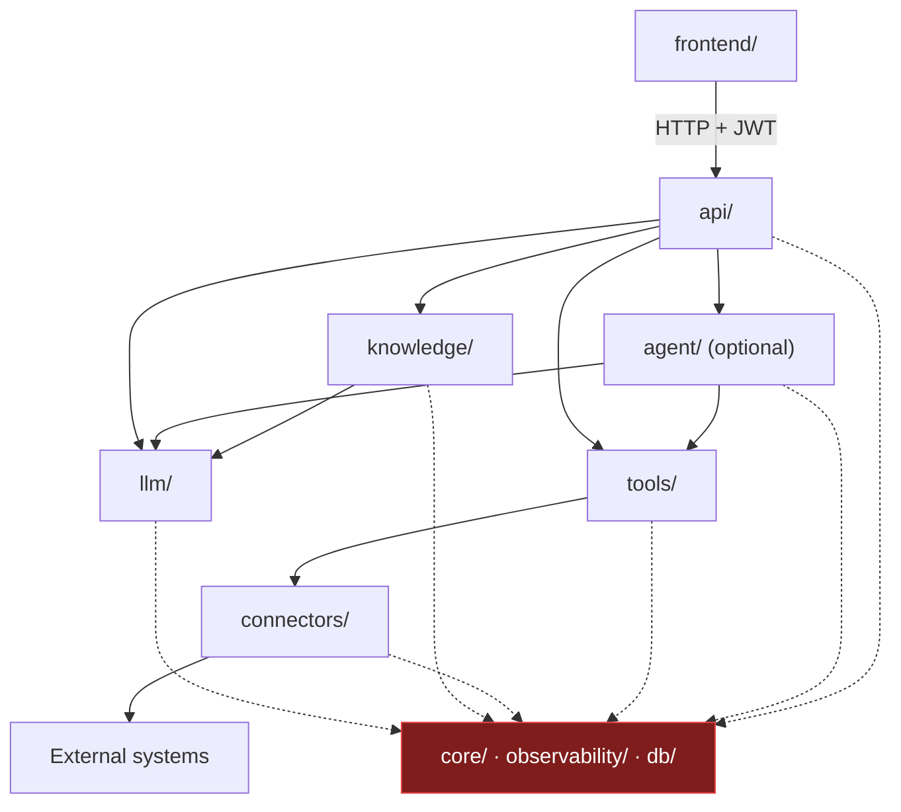
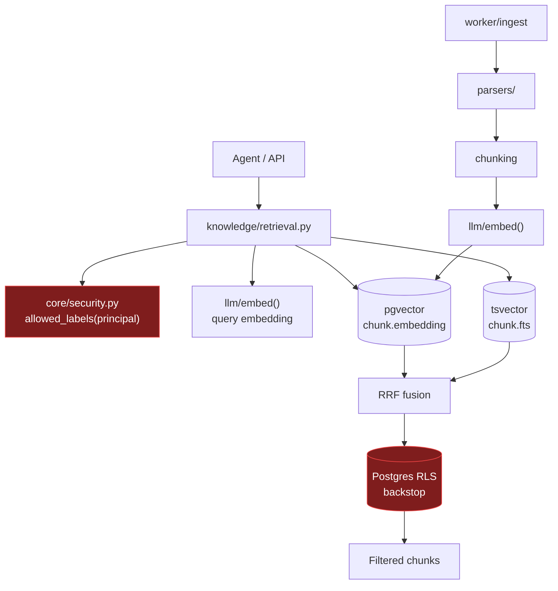
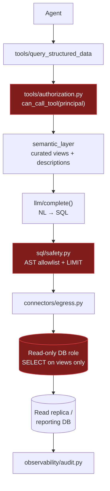
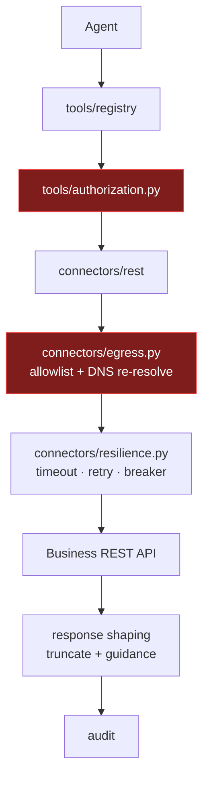
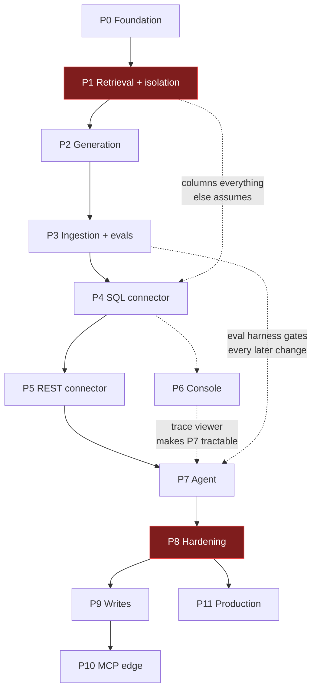
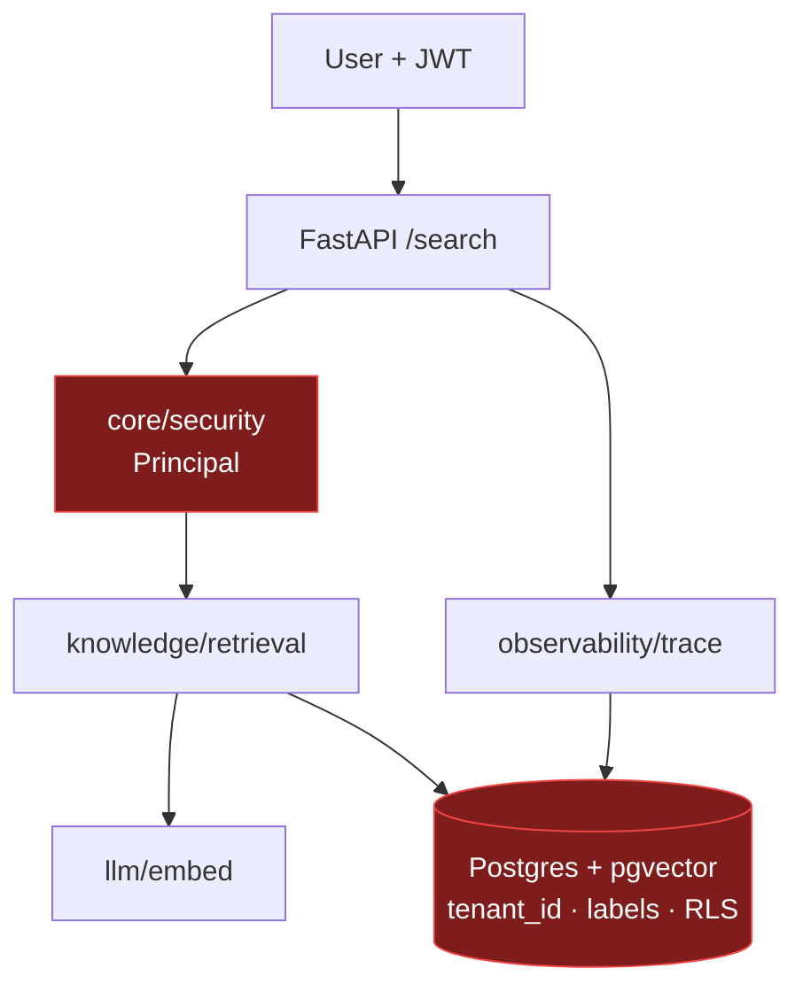

# Dependency Map — Enterprise AI Integration Platform

**Companion to:** [`ARCHITECTURE_REVIEW.md`](./ARCHITECTURE_REVIEW.md) · [`IMPLEMENTATION_ROADMAP.md`](./IMPLEMENTATION_ROADMAP.md)
**Date:** 2026-08-19

This document answers three questions: **what depends on what**, **what is required versus optional**, and **which dependencies are allowed to point in which direction**. The last one is the most useful — it is the rule that keeps the architecture from silently becoming a ball of mud.

---

## 1. The layering rule

```text
Frontend
   ↓
  API
   ↓
 Agent            (optional — Phase 7+)
   ↓
 Tools
   ↓
Connectors
   ↓
External Systems
```

**Dependencies point downward only. There are no upward imports and no lateral imports between sibling capability modules.**

Two rules follow, and both are enforceable in CI with an import linter:

- `connectors/` must never import from `tools/`, `agent/`, or `api/`. A connector that knows about the agent is not a connector.
- `agent/` must never import from `api/`. If it does, the agent cannot be extracted into a worker or a separate service later.

Cross-cutting modules (`core/`, `observability/`, `db/`) may be imported by anyone, and must import from nobody except each other. They sit outside the layer stack.



Note that `api → knowledge` bypasses the agent. That edge is deliberate: a simple question should reach retrieval directly without paying for agent orchestration. **The agent is an optional node in the request path, not a mandatory one** — which is the concrete meaning of "optional" in the layer diagram above.

---

## 2. The three capability chains

Your document names three data categories. Each is a separate dependency chain, and keeping them separate is what makes the platform coherent.

### 2.1 Knowledge chain (RAG)

```text
Agent (or API directly)
  ↓
RAG / retrieval
  ↓
Vector store (pgvector, inside Postgres)
```

Expanded, with the parts that are easy to forget:



**The non-obvious dependency:** retrieval depends on `core/security` *before* it touches the database, because the permission filter is part of the query, not a post-filter. If retrieval can be called without a `Principal`, the isolation guarantee is only a convention.

**The second non-obvious dependency:** retrieval and ingestion both depend on `llm/embed()`, and they must agree on the model. That agreement is recorded in `chunk.embedding_model`, not assumed. A query embedded with model B against chunks embedded with model A returns confident nonsense.

### 2.2 Structured chain (SQL)

```text
Agent
  ↓
SQL tool
  ↓
Database
```

Expanded, with every control shown:



**Read the three red boxes as a series, not alternatives.** The AST validator will eventually be bypassed by a construction you did not anticipate. The read-only role will not be, because it is enforced by Postgres rather than by your parser. Layer 4 catches mistakes; layer 5 catches attacks.

**Critical dependency direction:** `SEM → GEN`, not `GEN → schema`. The model generates SQL against *curated views with documented columns*, never against raw introspected tables. This is the single largest determinant of whether text-to-SQL works — the semantic layer, not the model.

### 2.3 Live chain (tools / APIs)



**The dependency people miss:** `response shaping`. A tool that returns 40,000 tokens of JSON does not just cost money — it degrades the model's ability to use anything else in its context. Truncation belongs in the tool layer, with a message telling the model how to narrow the request, not silently cutting off.

---

## 3. Required vs optional — by component

**Required** = the system cannot function without it.
**Optional** = the system functions; a capability is absent.
**Deferred** = optional today, likely required at a stated scale.

| Component | Status | Required by | Absent ⇒ |
|---|---|---|---|
| PostgreSQL | **Required** | everything | Nothing works |
| pgvector | **Required** | knowledge chain | No semantic retrieval |
| Alembic | **Required** | schema evolution | Every change is a manual ritual |
| `core/security` (Principal, policy) | **Required** | api, tools, knowledge | **No isolation. This is the one component with no degraded mode** |
| `llm/` interface | **Required** | knowledge, agent, sql | No embeddings, no generation |
| One LLM provider | **Required** | `llm/` | — |
| FastAPI | **Required** | api | — |
| `observability/` | **Required** | all | Undebuggable. Treated as required deliberately — see §5 |
| Redis | Required *in practice* | worker queue | Could be replaced by Postgres `SKIP LOCKED`; a legitimate simplification |
| Worker process | **Required** from Phase 3 | ingestion | Large ingests block the API |
| `connectors/` ABC | **Required** from Phase 4 | tools | Every integration invents its own shape |
| `tools/authorization` | **Required** from Phase 4 | tools | Excessive agency (OWASP LLM06) |
| `connectors/egress` | **Required** from Phase 4 | connectors | SSRF; cloud metadata theft |
| Hybrid search (tsvector) | Optional | knowledge | Poor recall on part numbers, codes, acronyms |
| Frontend | Optional | — | API-only; fine until Phase 6 |
| `agent/` | **Optional** | — | Single-hop answers only. Genuinely optional through Phase 6 |
| LangGraph | Optional | agent | Hand-rolled loop; fine for ≤3 steps |
| Reranker | Optional | knowledge | Lower precision. Add only if evals demand it |
| Evals | **Required from Phase 3** | tuning decisions | You are guessing. Marked required because tuning without it wastes more time than building it |
| Langfuse | Optional | — | Read traces from your own table |
| Prometheus/Grafana | Optional | — | No time-series view |
| Approval queue | **Required from Phase 9** | write tools | Unsafe writes. **Blocks Phase 9 entirely** |
| MCP server | Optional | — | No external agent interop |
| Keycloak | Deferred | — | Required when a customer needs SSO |
| Qdrant | Deferred | — | Required if measured p95 misses budget (~5M+ vectors) |
| Kubernetes | Deferred | — | Required for multi-node/HA/GPU. Not before |

---

## 4. Phase dependency graph

Which phases genuinely block which. Solid = hard block. Dashed = strongly recommended.



**Parallelizable:** P6 (console) can overlap with P4/P5 — different languages, different files. Nothing else should overlap.

**The two hard gates:**
- **P1 gates everything downstream** via the data model. Its four columns (`tenant_id`, `labels`, `embedding_model`, `content_hash`) are assumed by every later phase. Get them wrong and later phases inherit the error.
- **P8 gates P9.** Writes are not permitted until the security model has been attacked, not merely designed.

---

## 5. Cross-cutting dependencies (the ones that break architectures)

These do not fit the layer stack — everything depends on them — and that is exactly why they must be built first. A cross-cutting concern added late is not added; it is *retrofitted*, unevenly, and the gaps are invisible.

| Concern | Depended on by | Cost if added in Phase 1 | Cost if added in Phase 8 |
|---|---|---|---|
| `tenant_id` on every row | every table, every query | One line per table | Re-ingest corpus; audit every query; possible incident disclosure |
| Permission labels | ingestion, retrieval, tools | One column + a filter | Re-classify every document ever ingested |
| `Principal` threading | api, tools, knowledge, connectors | A parameter | Change every function signature in the call graph |
| Trace IDs | all | One decorator | Historical traces are unlinkable; you debug blind until the backfill |
| Cost attribution | `llm/` | Two columns | No historical cost data. **Unbackfillable — the data was never captured** |
| Audit log | tools, connectors, api | One table + one call | No record of what the AI did before this date |
| `embedding_model` per chunk | knowledge | One column | Model migration becomes archaeology |
| Secret redaction | logging, tracing | A type + a filter | Secrets already in log storage; rotate everything |

Read the right-hand column as the actual argument of this whole review. Five of these eight are literally impossible to backfill — the data was never recorded. That is why the roadmap moves them out of Phase 8.

---

## 6. External dependency risk

| External thing | Depended on by | Failure mode | Mitigation |
|---|---|---|---|
| LLM provider API | generation, embedding, NL→SQL | Outage; deprecation; price change | `LLMProvider` ABC; eval suite as the acceptance test for a swap |
| Embedding model | the entire corpus | Deprecation ⇒ full re-index | `embedding_model` per chunk; dual-read migration |
| Customer's read replica | SQL chain | Down, slow, schema drift | Circuit breaker; schema-drift detection; explicit degradation |
| Customer's REST API | live chain | Down, rate-limited, breaking change | Timeout, retry, breaker; contract tests |
| PyPI / npm | build | Supply chain (OWASP LLM03) | Lockfiles; pinned digests; dependency scanning in CI |
| Docker images | deploy | Tag mutation | Pin by digest, not tag |
| LangGraph 1.x | agent (P7+) | Breaking 2.x | Own the state model; pin exactly |
| LlamaIndex 0.x | parsers (if adopted) | **Frequent breaking changes at 0.x** | Adopt only behind your own `DocumentParser` interface |

---

## 7. Import rules to enforce in CI

Put these in `importlinter` (or equivalent) during Phase 0, while there is nothing to violate them.

```ini
# Layers — higher may import lower, never the reverse
[importlinter:contract:layers]
name = Architecture layers
type = layers
layers =
    app.api
    app.agent
    app.tools
    app.connectors

# Cross-cutting modules import nothing from the layers
[importlinter:contract:core-independent]
name = core must not depend on feature modules
type = forbidden
source_modules = app.core, app.observability
forbidden_modules = app.api, app.agent, app.tools, app.connectors, app.knowledge

# Evals must never be importable from production code
[importlinter:contract:evals-isolated]
name = production code must not import evals
type = forbidden
source_modules = app
forbidden_modules = evals

# Retrieval must go through the security policy
[importlinter:contract:retrieval-security]
name = knowledge.retrieval must import core.security
type = forbidden
source_modules = app.knowledge.retrieval
forbidden_modules = app.api, app.agent
```

The last one is a negative contract; pair it with a positive test asserting that `retrieval()` raises when called without a `Principal`. **A type signature that permits `principal=None` is a security bug with a default value.**

---

## 8. The minimum viable dependency set

Strip everything optional. This is what must exist for the platform to do anything useful at all:



**Six components.** No agent, no connectors, no LLM generation, no frontend, no Redis, no worker, no framework beyond FastAPI.

This is exactly Phase 1, and it is the first thing to build. Everything else in this document is an extension of it — which is the point: if the six-component version has the right data model and the right chokepoints, the rest is addition rather than surgery.
